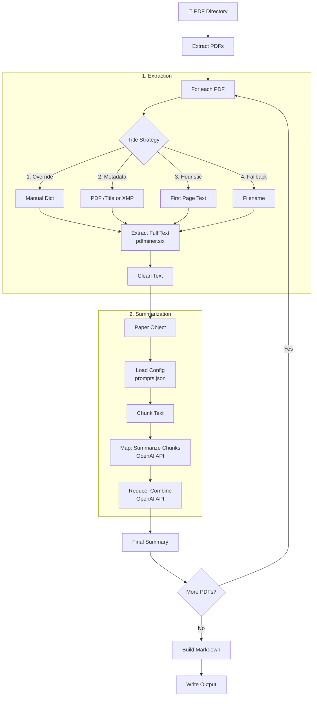

# paper2md

Automatically generate structured markdown summaries of academic PDFs for use as context in engineering codebases.

## Features

- **Sophisticated title extraction**: PDF metadata (/Title, XMP) → first-page text heuristics → filename fallback
- **LLM-based summarization**: OpenAI-compatible API with map-reduce strategy for high-quality summaries
- **Multiple LLM providers**: Supports OpenAI, OpenRouter, Gemini, or any OpenAI-compatible endpoint
- **Structured output**: TL;DR, Problem, Approach, Results, Practical Takeaways, Limitations
- **Incremental processing**: Caches extracted text, skips re-extraction for unchanged PDFs
- **Customizable prompts**: Configure via `prompts.json`

## Installation

```bash
# Create & activate a virtual environment (recommended)
uv venv

# Windows (PowerShell)
.\.venv\Scripts\Activate.ps1

# macOS/Linux
source .venv/bin/activate

# Install dependencies
uv pip install -r requirements.txt

# Required: Set up environment variables
cp .env.local .env
# Edit .env and add your OPENAI_API_KEY (required)
```

## Configuration

### Environment variables

- `OPENAI_API_KEY` - **Required** for LLM summarization
- `OPENAI_MODEL` - Model to use (default: `gpt-5-mini-2025-08-07`)
- `OPENAI_BASE_URL` - API base URL (optional, for OpenRouter, Gemini, etc.)

### prompts.json

Customize summarization prompts and chunking via `prompts.json`:

```json
{
  "chunk_prompt": "...",
  "reduce_prompt": "...",
  "chunk_max_chars": 12000,
  "max_chunks": 8
}
```

**Available Keys:**
- `chunk_prompt`: Template for summarizing individual chunks. Placeholders: `{title}`, `{idx}`, `{total}`, `{chunk}`.
- `reduce_prompt`: Template for the final combination step. Placeholders: `{title}`, `{summaries}`.
- `chunk_max_chars`: Maximum characters per text chunk (default: `12000`).
- `max_chunks`: Maximum number of chunks to process per paper (default: `8`).

## Usage

```bash
# Basic usage (requires OPENAI_API_KEY in .env or environment)
python summarize_papers.py

# Or set API key inline
OPENAI_API_KEY=sk-... python summarize_papers.py

# Custom options
python summarize_papers.py --papers-dir papers --out output/PAPERS_SUMMARY.md --max-pages 10

# Force re-summarize all papers (ignore cache)
python summarize_papers.py --no-cache

# Clear cache and re-run
python summarize_papers.py --clear-cache
```

### Command-line options

- `--papers-dir DIR` - Directory containing PDFs (default: `papers`)
- `--out FILE` - Output markdown path (default: `output/PAPERS_SUMMARY.md`)
- `--max-pages N` - Limit pages per PDF, 0 = all pages (default: 0)
- `--no-cache` - Disable caching, re-extract text from all PDFs
- `--clear-cache` - Clear cache before running

## Process Flow



**Key stages:**
1. **PDF → Paper** - Title extraction cascade + text extraction with fallback strategies
2. **Paper → Summarized Paper** - Map-reduce LLM summarization (chunk → summarize → combine)
3. **Papers → Markdown** - Build structured output with index and summaries

## Architecture

The codebase follows a **deep modules** design pattern with strict separation of concerns:

- `lib/pdf_extract.py` - Deep module hiding all PDF parsing complexity
- `lib/text_clean.py` - Pure text transformation functions
- `lib/content_analysis.py` - Pure analysis functions (abstract, DOI, contributions)
- `lib/summarization.py` - LLM-based summarization (OpenAI)
- `lib/cache.py` - Caches extracted text (not summaries) for incremental processing
- `lib/models.py` - Immutable dataclasses (Paper, ExtractedContent)
- `summarize_papers.py` - Thin orchestration layer

## Adding PDFs with Missing Metadata

If a PDF's title metadata is corrupt or missing, add an override to `lib/pdf_extract.py`:

```python
TITLE_OVERRIDES: dict[str, str] = {
    "filename.pdf": "Actual Paper Title",
}
```

## Output Format

Generated markdown includes:

- Index of all papers with anchor links
- Per-paper summaries with:
  - TL;DR (3 bullets)
  - Problem statement
  - Approach/methodology
  - Results with metrics
  - Practical takeaways
  - Limitations and open questions
  - DOI link (if available)

## Dependencies

- `pdfminer.six` - PDF text extraction (preferred for two-column layouts)
- `python-dotenv` - Environment variable loading
- `tqdm` - Progress bars
- `openai` - **Required** for LLM-based summarization

## License

See LICENSE file for details.
